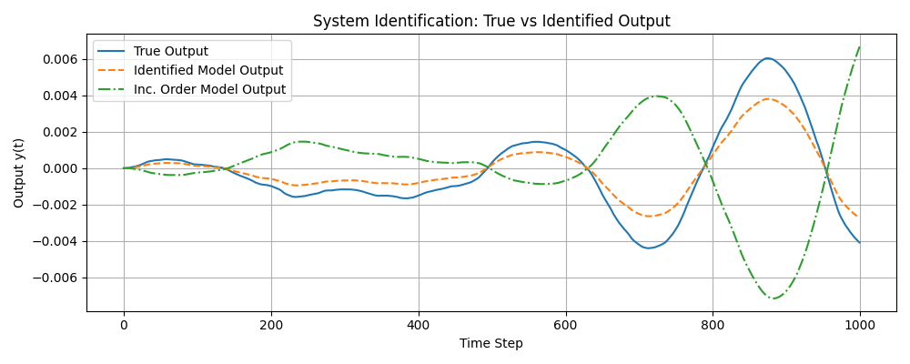
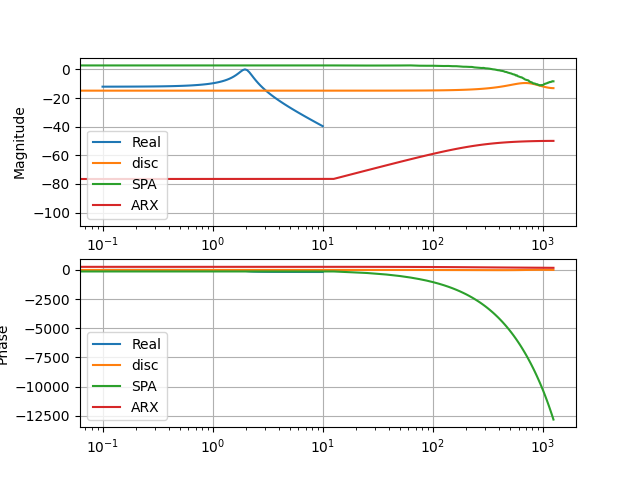

# MTB Rear Shock Suspension System Identification

## Abstract

Mountain bikes utilize a mass-spring-damper as rear-suspension to provide more control and comfort to the rider. In this investigation, we utilize two methods to identify the transfer function of the LTI-system that represents the rear-suspension system of a mountain bike. We show that...

Directions:

1 (easy) - we can identify the current tuning of the suspension system. 

The current tuning dampens frequencies. The current tuning is defined as the spring constant(shock airpressure), damper coefficient(firmness setting).

2 (hard) - how to adjust the tuning to actively dampen all frequencies

we can actively adjust the tuning of the system from the current tuning to the desired tuning.

## Introduction

### Motivation
Determining the model of the suspension system could improve the performance of the bike by giving the rider more control through more accurate dampening.

Provide feedback to the rider on how to tune their bike to the optimal settings(air/spring pressure, damping firmness setting)

Ideally the bode plot would attenuate the roughest frequencies. Attenuated signals have negative amplitude on the bode plot.

### Background

Current Technology: Automotive Industry | active damping, bose magic carpet suspension. Bike Industry | active valve, automatic inertial valve adjustment, Fox DHX Live Valve Neo, RockShox Flight Attendant. Consumer Electronics | Apple Active Noise Cancellation.

Fox DHX Live Valve Neo: Opens and closes the firmness of the rear-shock. Two sensors mounted on the front and rear brakes. Sensors are accelerometers. System determines if you are in Climb, Flat, Descend. Each scenario has a different threshold to switch from open to closed. The system will also stay open for longer depending on the scenario after an impact. (https://enduro-mtb.com/en/fox-live-valve-neo-shock-test/). My response: This system isn't actively damping disturbances, it seems to react by changing to different scenarios. I am wondering about the capability of the mechanism in the shock to shift quickly in order to respond in real-time.

Bose Magic Carpet Suspension: ClearPath uses active-valve dampers and magnetic fluid.  (https://www.thedrive.com/news/legendary-bose-magic-carpet-suspension-is-finally-going-global). My response: They might be scanning the road ahead. Using lidar to see what to expect would be helpful to cars but not applicable to a mountain bike application.

## Methods
Goal: Identify the system response to inputs.

A good way to get an idea of the system response is to investigate the bode plot. The bode plot shows quantitative information about delays, model-order, and signal amplification/attenuation. 

Bounded Goal: Plot a Bode plot of the system response, to analyze which frequencies of signals get amplified or attenuated.

We utilize two methods to determine the transfer function that the system represents.

### Definitions

System: The plant that takes the input signal and turns it into the output through dynamics.

Input: The input to the plant is the force felt to the rear wheel.

Output: The output of the plant is the displacement of the unsprung-mass, or the section of the frame that the rider holds on to.

System Response: the frequencies of the input that are passed through the system to the output.

### Step 1: Determine the Transfer Function X(s)/F(s)
Objective --- 
Plot the Bode plot of the TF: X(s)/F(s) to understand the quantitative behavior(order and delays).
#### Idea 1.1: Spectral Analysis (SPA)

Build a TF from frequency domain analysis
$$
G(e^{j\omega_m}) = \frac{\Phi_{yu}(\omega_m)}{\Phi_{uu}(\omega_m)}
$$
where:
$$
\Phi_{yu}(\omega) = \lim_{N \to \infin} \mathbb{E} \{P^N_{yu}(\omega)\}\\

P^N_{yu}(\omega) = DTFT\{ \hat R^N_{yu}(\tau)\}
$$

Tools:
SciPy Toolbox

Terms:
Empirical Transfer Function Estimate (ETFE)
Spectral Analysis(SPA)
Convergence of ETFE to SPA through using a weighting window to smooth a neighborhood of frequencies.

#### Idea 1.2: Building an Auto Regressive Exogeneous(ARX) Model

Use the Least-Squares method to estimate the parameters in a discrete-time transfer function.

Dynamic model is a linear Infinite Impulse Response Filter(IIR)

1. Determine ARX, IIR model order (number of zeros, number of poles).
2. Run the least-squares estimate to get the parameters of the model.
3. Put in TF form, and plot.

#### System Model Derivation of a Mass-Spring-Damper
Equations of Motion:
$$
m \ddot x(t) + c \dot x(t) + k x(t) = F(t)
$$

Continuous-time TF:
$$
X(s) = \frac{1}{m s^2 + c s + k} F(s)
$$

Zero-order hold to convert to TF(z)(using MATLAB c2d).

discrete TF:
$$
X(z) = \frac{b_1 z + b_2}{z^2 + a_1 z + a_2} F(z)
$$

difference eqn:
$$
x(k + 2) + a_1 x(k + 1) + a_2 x(k) = b_1 F(k + 1) + b_2 F(k + 2)\\

\text{is equivalent to}\\

x(t) + a_1 x(t - 1) + a_2 x(t - 2) = b_1 F(t - 1) + b_2 F(t)\\

\text{and}\\

x(t) = -a_1 x(t - 1) - a_2 x(t - 2) + b_1 F(t - 1) + b_2 F(t)
$$

Simulated response of a system given a random input force:

### Step 2: Plot the Transfer Function on a Bode Plot

Using SciPy Tools, we plot the system response from all the models that we are investigating.

This image shows inconsitencies between the models.

### Step 3: Test the Reliability of Data
Test consistency of convergence

## Results

Real Example: Data collected from an MTB

Using actual data the results of these methods show.

Bode Plot Comparisons to the real data:

## Further Research

1. Control of the suspension such that stability is maintained when disturbances are placed as forces on the rear suspension. Stability of the system is defined as the fixed point of the plant that the rider holds in neutral position. Using MPC to control the current state back to the fixed point.

2. Neural Networks to map the input data to the output data.

3. Rider-to-bike Relationship: Does the rider trust a shock that changes suspension characteristics.

## Resources

$$
\tau = -I_p \ddot \phi \\
$$

$$
I_{b} \ddot \theta = -I_p \ddot \phi - L \cdot F \sin(\alpha)
$$

$$
-\frac{s^2I_p + L \cdot F}{s^2 I_b}
$$

$$
I_b \ddot \theta
$$